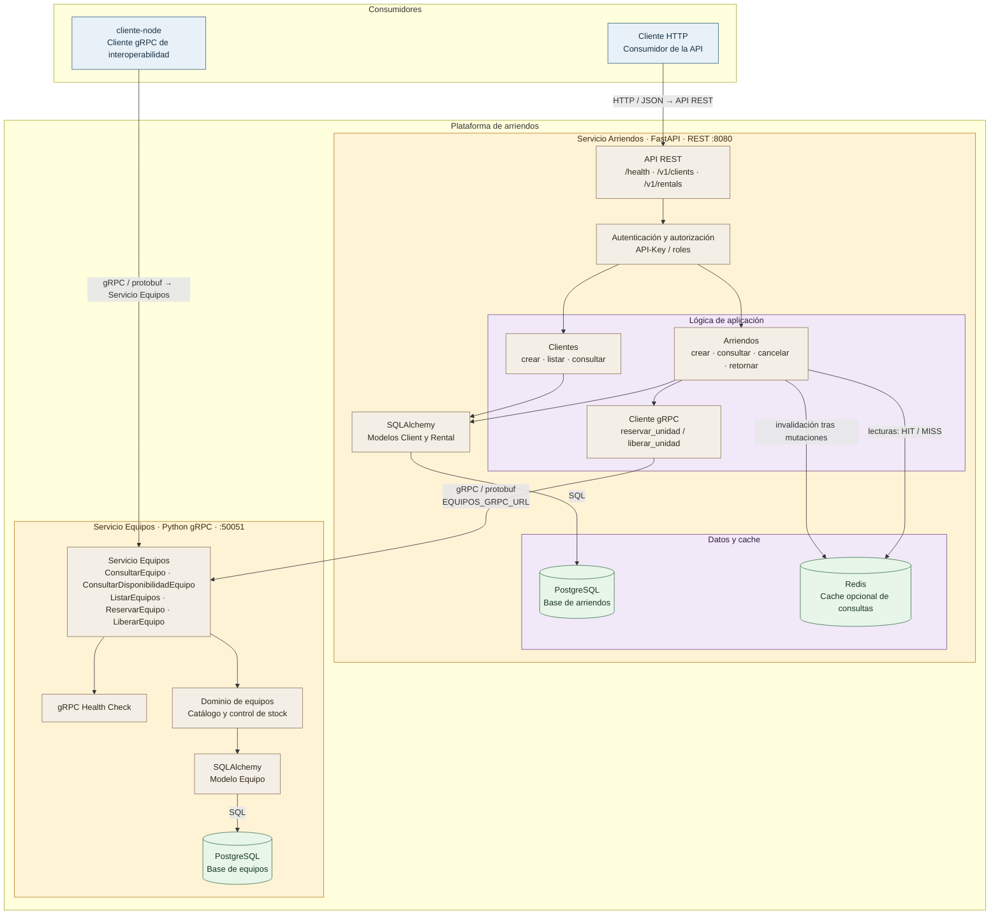

# Arquitectura y descomposición en servicios

## Flujos principales

- **Crear arriendo:** `Cliente HTTP -> arriendos-api -> PostgreSQL de arriendos` y, antes de confirmar, `arriendos-api -> equipos-api -> PostgreSQL de equipos` para reservar una unidad.
- **Consultar arriendos:** `arriendos-api` intenta resolver desde Redis cuando está activo; ante un `MISS`, consulta PostgreSQL y almacena el resultado durante 60 segundos.
- **Cancelar o retornar:** `arriendos-api` libera la unidad mediante gRPC, actualiza el estado local y elimina las entradas de cache relacionadas.
- **Interoperabilidad:** `cliente-node` consume directamente el contrato `Equipos/equipos.proto` y prueba las operaciones gRPC del catálogo.

La separación de datos es por servicio: cada API posee su propia base PostgreSQL y el servicio Arriendos no accede directamente a la base de Equipos. La comunicación entre servicios se realiza exclusivamente mediante gRPC.
